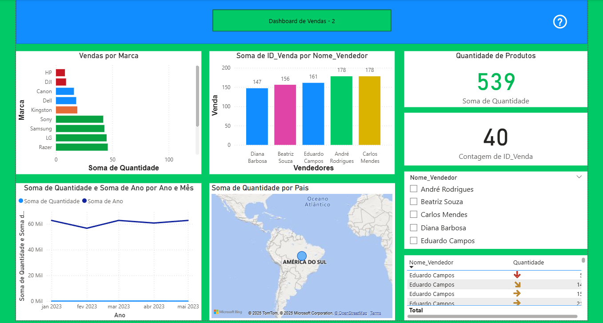

# 📊 Dashboard de Vendas em Power BI

Este projeto apresenta um dashboard interativo desenvolvido no Power BI para análise de desempenho comercial. O objetivo é fornecer uma visão clara e estratégica das vendas por marca, vendedor, região e período.

## 🎯 Objetivo

Monitorar indicadores-chave de vendas, como:
- Quantidade de produtos vendidos
- Contagem de vendas realizadas
- Média de valor total por venda
- Distribuição geográfica das vendas
- Performance por vendedor e por marca

## 🧠 Funcionalidades

- Filtros dinâmicos por gerente regional, vendedor e ano
- Gráficos de barras, linhas e mapas interativos
- Tabelas com segmentação por país e região
- Indicadores visuais de tendência (setas de desempenho)
- Uso de DAX para medidas personalizadas e inteligência temporal

## 🛠 Tecnologias

- Power BI Desktop
- DAX (Data Analysis Expressions)
- Modelagem de dados
- Visualizações interativas

## 🖼 Preview

## 📁 Arquivo

O arquivo `.pbix` está disponível na pasta `Arquivo/`.

## 📞 Contato

Para dúvidas, sugestões ou colaborações, entre em contato pelo [LinkedIn](http://www.linkedin.com/in/ana-beatriz-marques-ferreira-42125121a).

